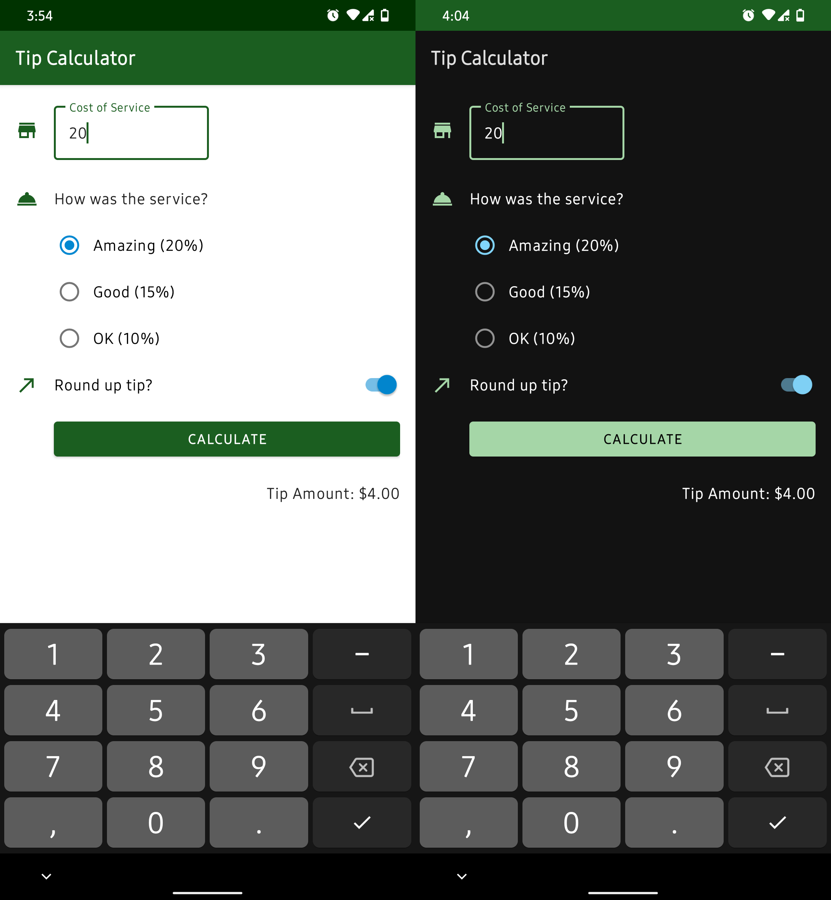

<h1> TipCalculator </h1>

A simple tip calulator android app

## What does this app do?

The Tip Calculator calculates tip amount for three most-used percentages (based on the service's quality) of the  cost of the service, and also provides a total amount that includes the  tip.

This app provides a quick way to calculate your tip with a simple design and straightforward user interface.

## Compatibility

The Tip Calculator requires at least Android 5 Lollipop.

This app will work properly on devices without any Google service installed.

